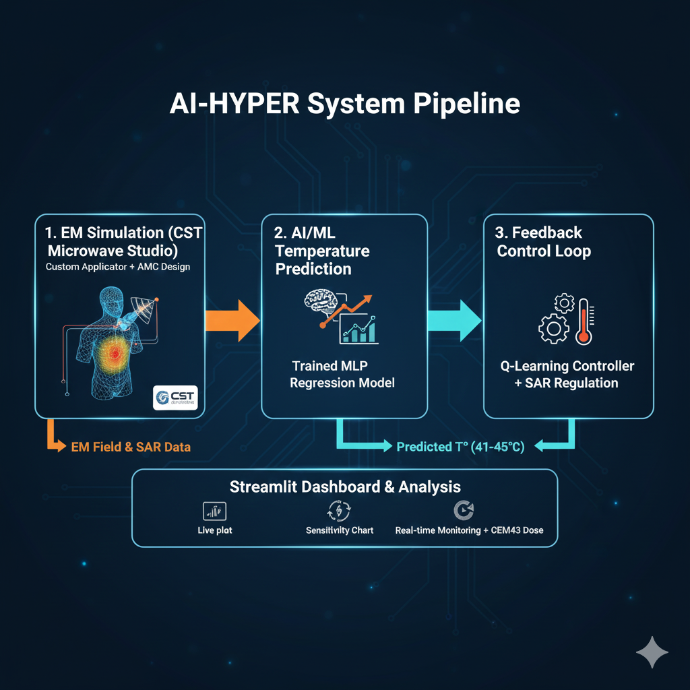
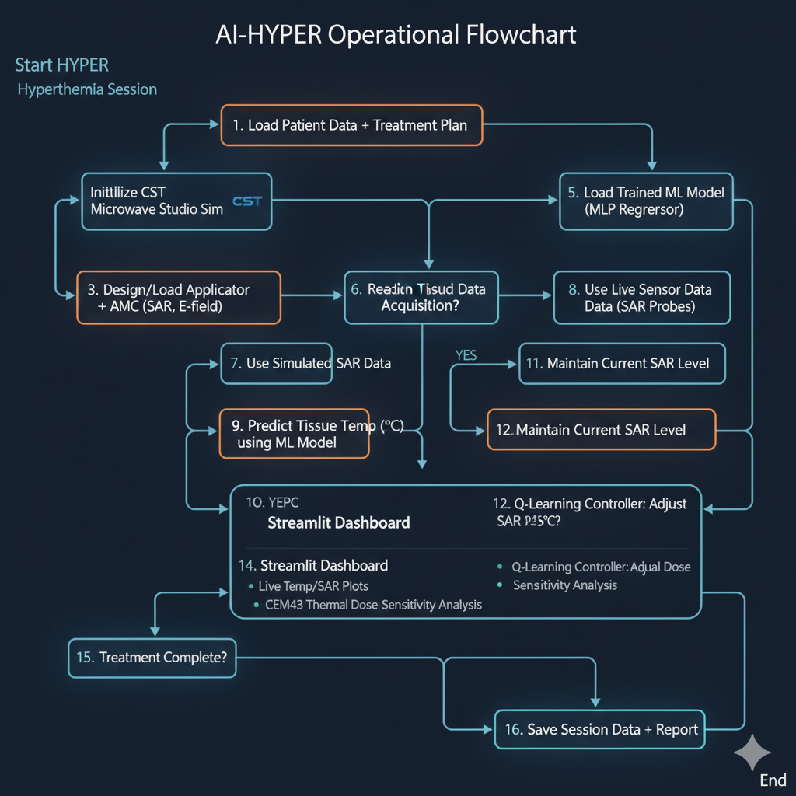

# 🔥 AI-HYPER — AI-Driven Hyperthermia Temperature Control System

**Author:** Your Name  
**Year:** 2025  

AI-HYPER is an intelligent hyperthermia control framework that integrates **CST Microwave Studio antenna simulations**, **Machine Learning temperature prediction**, and **closed-loop SAR regulation** to maintain tissue temperature between **41–45°C** — the clinically safe hyperthermia therapeutic window.

This project combines **Electromagnetics**, **Biomedical Engineering**, and **Artificial Intelligence** into a single interactive simulation dashboard built using **Streamlit**.

---

# 🚀 Key Features

### ✅ **CST Antenna + AMC Design**
- Custom microwave hyperthermia antenna designed in **CST Studio Suite**
- Integrated **Artificial Magnetic Conductor (AMC)** layer
- Improves:
  - Forward radiation
  - SAR focusing on tumor region
  - Heating uniformity
  - Reduces backward radiation toward healthy tissue
- CST results (S11, SAR plots, thermal maps) can be placed in:

cst_results/
├── antenna_design/
├── with_amc/
└── without_amc/

### ✅ **MLP Temperature Prediction Model**
A neural network (MLPRegressor) was trained on CST-generated data to predict tissue temperature from:

- SAR  
- Electric Field  
- Frequency Index  
- Tissue Depth  
- AMC Presence  
- Tissue Region  

**Why MLP over Decision Tree?**  
Hyperthermia temperature is a **smooth, nonlinear physical process**.  
Decision Trees produce step-like, unrealistic predictions and overfit easily.  
MLP provides **continuous, accurate, physics-like temperature prediction**.

Model saved as:
models/hyperthermia_temp_model.pkl

### ✅ **Real-Time Temperature Control Simulation**
The Streamlit app simulates and visualizes:

- Temperature vs. Time  
- SAR adjustments vs. Time  
- Therapeutic band (41–45°C)  
- Thermal inertia effects  
- Live metrics box  
- Final stability result  

SAR automatically increases or decreases to keep temperature within target limits.

---

### ✅ **Reinforcement Learning (Q-Learning) Controller**
The RL agent learns SAR adjustment behavior:

- Maximizes time spent within 41–45°C  
- Penalizes overheating  
- Learns optimal SAR patterns  
- Lightweight & fast training  

---

### ✅ **CEM43 Thermal Dose Estimation**
CEM43 (Cumulative Equivalent Minutes at 43°C) is a clinical metric used to evaluate therapeutic thermal dose.

The app accumulates CEM43 over time using:
CEM43 = duration * R^(43 - T)


Where:
- R = 0.5 if T ≥ 43°C  
- R = 0.25 if T < 43°C  

---

### ✅ **Sensitivity Analysis**
A one-at-a-time (OAT) sensitivity engine identifies how each parameter affects final temperature.

Outputs a bar graph showing influence of:

- SAR  
- E-field  
- Frequency  
- Depth  
- AMC presence  
- Tissue type  

---

# 📌 Full System Pipeline  
_(add `assets/pipeline.png` here once you upload it)_



### **Pipeline Stages**

#### **1️⃣ CST Simulation**
- Antenna designed in CST  
- AMC-backed version simulated  
- Exported SAR / E-field / Depth / Tissue data  

#### **2️⃣ Dataset Preparation**
- CSV cleaned  
- Numeric scaling + one-hot encoding  
- Train-Test Split  

#### **3️⃣ MLP Temperature Model**
- Best model selected by GridSearchCV  
- Saved as `.pkl` pipeline  

#### **4️⃣ Streamlit Dashboard**
- Temperature prediction  
- Real-time simulation  
- Control loop  
- Visual graphs  

#### **5️⃣ Closed-Loop SAR Control**
- Auto-regulator  
- OR RL controller  
- Maintains 41–45°C  

---

# 📊 Flowchart  
_(add `assets/flowchart.png` here once you upload it)_



---

# 📁 Repository Structure

AI-HYPER/
├── assets/ # images used in README (banner, pipeline, flowchart)
├── data/ # dataset (ignored in .gitignore)
├── models/ # trained ML models (*.pkl)
├── cst_results/ # CST S11, SAR, E-field, AMC results
│ ├── antenna_design/
│ ├── with_amc/
│ └── without_amc/
├── results/ # evaluation plots, metrics
├── scripts/
│ ├── prepare_data.py
│ ├── train_model.py
│ └── evaluate_model.py
├── streamlit_app.py # full hyperthermia control app
├── README.md
├── requirements.txt
├── .gitignore
└── LICENSE


---

# 🧩 Installation & Quick Start

1. Clone the repo
```bash
git clone https://github.com/akshat4703/AI-HYPER.git
cd AI-HYPER

2. Install dependencies
pip install -r requirements.txt

3. Add your trained model
Place the model at : models/hyperthermia_temp_model.pkl

4. Run the Streamlit app
streamlit run streamlit_app.py

This project is licensed under the MIT License.
See LICENSE for details.

📣 Contact

For project guidance or collaboration:
akshat4703@gmail.com
